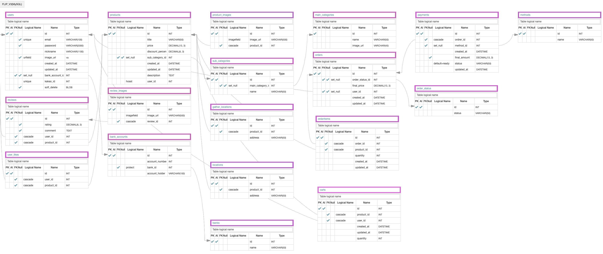

##

---

# FLIP | 플립

  

---

## frip | 프립

- [프립](https://www.frip.co.kr/) 사이트
- 소개: 여가, 액티비티 공유 플랫폼

## 팀원

- Front-end: 금보배, 김세준, 지의선
- Back-end: 서동규, 성우진, 손명희(PM)

## 개발 기간

- 기간: 2021.09.13 ~ 2021.10.01 (16일)

## 적용 기술

- Back-end: Django, Python, MySQL, jwt, bcrypt, Storage, Transaction, AWS S3, AWS RDS, AWS EC2
- 협업툴: Trello, Slack, Github(Rebase), AQuery

## 영상

[프립 구현 영상](http://www.youtube.com)

## 구현 기능 및 개인 역할

`서동규`

상품 장소 조회 API

- kakao 지도 API를 활용해 좌표 조회 
- timeout옵션을 사용해서 외부 API 서버 의존성을 줄임
- 외부 서버 통신시 발생하는 모든 에러에 대한 테스트 코드 작성 
- sideeffect를 활용해 requests 모듈의 다중 요청에 대한 테스트 코드 작성 

상품 조회 API, 상품의 리뷰 조회 API

- select_related, prefetch_related를 사용해서 ORM쿼리 호출 최적화 
- 각 분기별 테스트 코드 작성 
- RESTful한 엔드포인트 작성 
- annotate분법을 활용해서 ORM쿼리문 작성 

상품 좋아요 API
- 로그인 데코레이터를 사용해서 API 접근 권한을 나누어줌 
- 각 분기별 테스트 코드 작성 

`성우진`

-

`손명희`

[카카오소셜로그인]

- Kakao API를 통한 Social login 기능구현
- Front로부터 받은 kakao access token을 POST 메소드를 통해 Kakao API로 전달하고
  사용자가 수집에 동의한 개인정보를 전달 받아, 로그인에 성공한 사용자에게 token을 발행.
- UNIT TEST를 통한 효율적인 테스트 구현

[호스트 등록]

- 로그인한 사용자의 계좌정보 등록 기능 구현(계좌번호, 은행정보)
- UNIT TEST를 통한 효율적인 테스트 구현

[호스트의 상품등록]

- 계좌 정보를 등록한 사용자에 한해 상품을 등록할 수 있는 권한을 부여하여, 상품을 등록하도록 함.(상품 제목, 설명, 이미지, 모임장소, 진행장소 등 )
- 상품 등록 시 AWS S3 bucket을 활용하여 상품의 이미지를 업로드 및 조회 하도록 함.
- transaction을 활용한 상품등록 기능구현

[AWS deploy (EC2 / RDS / S3)]

 

## EndPoint

[post] UserProductView         : /products/host/<int:user_id>  

[get] UserProductView          : /products/host/<int:user_id>  

[get] ListCategoryView         : /products/main_category/<int:main_category_id>  

[get] ProductDetailView        : /product/<int:product_id>  

[post] LikeView                : /product/<int:product_id>/like 

[get] ReviewView               : /product/<int:product_id>/review  

[get] MainPageCategoryView     : /products/main_page_category

[post] LocationView            : /product/<int:product_id>/location

[post] ImageUploadView         : /product/<int:product_id>/host/<int:user_id>/image_upload

[post] KakaoSignInView         : /signin

[post] BankAccountView         : /bank_account/<int:user_id>

[get] BankAccountView          : /bank_account/<int:user_id>

[get] ProductListView          : /products/list/<int:main_category_id>?sub_category_id=&order=

## Modeling

## 소감 및 후기

- 서동규: ([후기](https://업로드후수정.com)-개인 벨로그)

- 성우진: ([후기](https://업로드후수정.com)-개인 벨로그)

- 손명희: ([후기](https://업로드후수정.com)-개인 벨로그)

## 레퍼런스

- 이 프로젝트는 [프립](https://www.frip.co.kr/) 사이트를 참조하여 학습목적으로 만들었습니다.
- 실무수준의 프로젝트이지만 학습용으로 만들었기 때문에 이 코드를 활용하여 이득을 취하거나 무단 배포할 경우 법적으로 문제될 수 있습니다.
- 이 프로젝트에서 사용하고 있는 사진 대부분은 위코드에서 구매한 것이므로 해당 프로젝트 외부인이 사용할 수 없습니다.